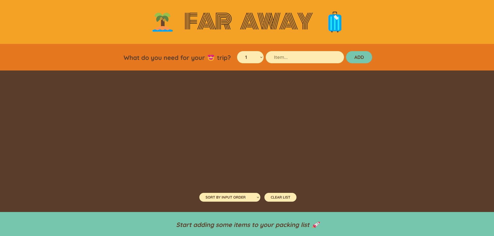

# Introduction

Single page react app that works as a personal traveling list for all the items someone would take for a trip. It allows adding items, marking them as packed, deleted items, sorting by input order, sorting by item name, or sorting sorting by packed status. Created in order to implement a relatively simple frontend and to check my understanding of react concepts. Currently, the user data is not transferred over after a refresh but I might revisit the project and add some sort of backend.

# Site

